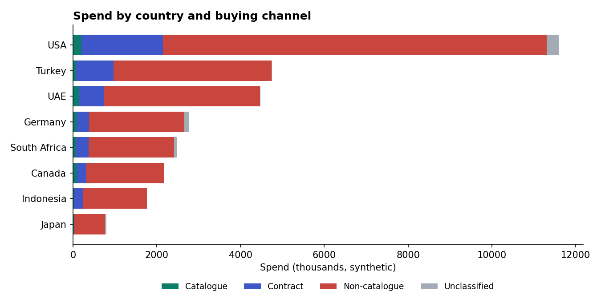
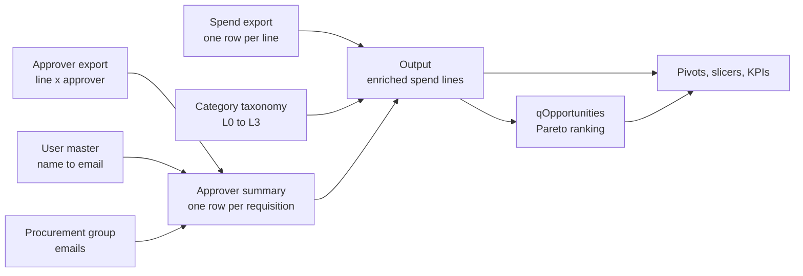
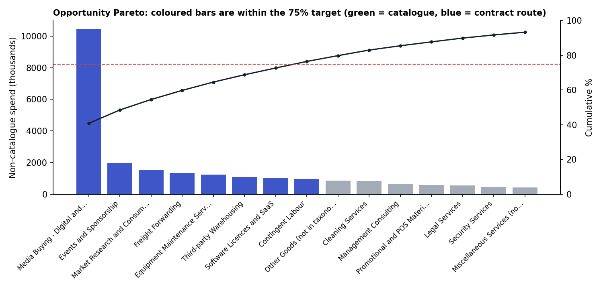
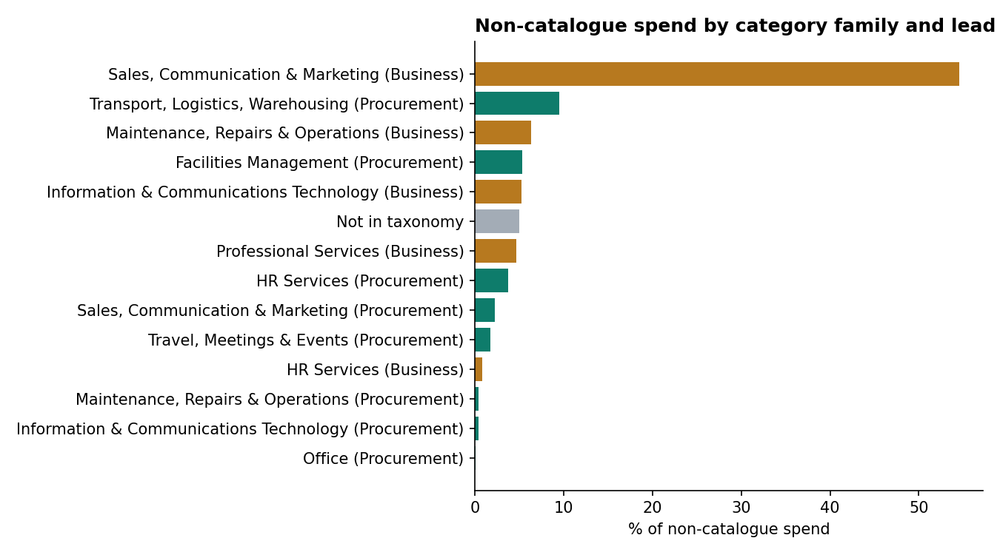

# Procurement catalogue and contract opportunity analysis (Excel Power Query)

An Excel-only pipeline that turns raw e-procurement exports into a refreshable view of **how much spend goes through catalogues and contracts**, **who actually approves it**, and **which categories to move on-platform first**.

Built to support an e-procurement adoption programme across several countries. Everything runs inside Excel with Power Query and pivot tables, so the data never leaves the workbook. Monthly refresh is one click.

> All data in this repository is **synthetic**. Supplier names, people, emails and amounts are generated by `scripts/generate_sample_data.py`. No company data is included.



## The business questions

1. **How much spend is off-catalogue, by country and category?** Every non-catalogue line must be reported, so the category view has to reconcile to 100%.
2. **Where should catalogues and contracts be built?** The goal is a prioritised list of candidates covering a target share (75%) of non-catalogue spend.
3. **Is procurement involved where the taxonomy says it should be?** This compares the category's intended lead (procurement- or business-led) with who actually approved each requisition.

## How it works



| Step | What happens | Why it matters |
| --- | --- | --- |
| Clean keys | Trim, collapse whitespace, replace non-breaking spaces, lowercase | Exports and taxonomies rarely match character for character |
| Taxonomy match | Match on the **short or long** commodity name; flag Matched, Unmapped, Ambiguous or Blank | Gives every line a category, and surfaces gaps instead of hiding them |
| Buying channel | Catalogue, Contract, Non-catalogue or Unclassified, **one value per line** | Spend stays additive, so pivots always reconcile |
| Approvers | Name to email via user master (active accounts first), email to procurement group, then collapse to **one row per requisition** | The approver export repeats lines per approver; joining it directly would multiply spend |
| Approval route | Procurement only, Business/Finance only, or both | Shows whether procurement was actually involved, not just whether it should have been |
| Dates | Parse source text dates as M/D/YYYY; add Month and PO Month | Prevents silent day/month swaps |
| Country | Map purchasing organisation codes to names; unknown codes show as `XX01 (not mapped)` | New countries are visible straight away |
| Opportunities | Rank non-catalogue commodities, running cumulative share, in-scope flag at the target, priority and suggested route | Turns analysis into an action list |

### Opportunity rules (`qOpportunities.pq`)

- **Catalogue** if the commodity is bought often in small amounts (at least 20 lines and an average of 1,000 or less per line).
- **Contract with top supplier** if one supplier holds at least 60% of the spend.
- **Contract, consolidate suppliers** if five or more suppliers are used.
- Otherwise **Contract**.
- **Priority:** High until 50% cumulative share, Medium until the target, Low after that.

All thresholds are settings at the top of the query.





## Repository layout

```
powerquery/
  Output.pq              main transformation (paste into Advanced Editor)
  qOpportunities.pq      Pareto ranking and suggested route
sample-data/             synthetic input files with the real export layouts
scripts/
  generate_sample_data.py   recreates the sample files
  preview_dashboard.py      re-implements the logic in pandas to cross-check and draw the charts above
docs/
  setup-guide.md         step-by-step build in Excel
  dashboard-pivots.md    pivot recipes for the leadership slides
  design-notes.md        design decisions and problems solved
```

## Try it

1. Download `sample-data/` into one folder.
2. Follow [docs/setup-guide.md](docs/setup-guide.md). It takes about 20 minutes and covers loading the five files, pasting the two queries, and loading Output and qOpportunities.
3. Build the pivots in [docs/dashboard-pivots.md](docs/dashboard-pivots.md).

To check the logic without Excel:

```bash
pip install pandas openpyxl matplotlib
python scripts/generate_sample_data.py
python scripts/preview_dashboard.py
```

## Skills demonstrated

Power Query M (custom functions, record lookups, grouping, nested joins, running totals), data modelling at the right grain, reconciliation and data-quality checks, Pareto prioritisation, pivot-based reporting, and turning a manual VLOOKUP process into a refreshable pipeline.

## License

MIT
